  

<h2 style="font-size:50px;" align="left">
   About Me
</h2>

I’m Diego Vega, a fullstack developer, software engineering student and freelancer based in México. 
I work on freelance and personal projects, passionate about creating innovative solutions, exploring new technologies, and constantly improving my skills. 
Currently diving deeper into blockchain, Web3, and cybersecurity, building things that connect Web3 with real needs.

**🔭 I’m currently working on:** [ZKML-Soroban](https://github.com/ZKML-Soroban/ZKML-Soroban) & [BolPay](https://github.com/diegoveme/BolPay)  
**🌱 I’m currently learning:** Rust and building Smart Contracts with Soroban  
**💡 My focus areas:** Web development, Blockchain & Web3, Smart contracts, Cybersecurity, Linux  
**👯 I’m looking forward to:** Collaborating on open source projects  
**🗣️ Languages:** Español · English (B2) · Français (A2)  
**⚡ In my free time:** Exploring Rust, Web3, cybersecurity, and experimenting with Linux environments to strengthen my developer workflow  

---

<h2 style="font-size:50px;" align="left">⚙️ Tech Stack</h2>

## Languages

     
     
     
     
     
     
     
     
     

## Backend  

     
     
     
     

## Frontend  

     
     
     
     
     
     
     
     

## Databases  

      
     
     

## Web3 & Blockchain  

     
     
     
     
     

## OS

     
     
     

## Tools  

     
     
     
     
     
     
     
     
     
     
     

---

---

<h2 style="font-size:50px;" align="center">🤝 Connect with me</h2>

  
  
  
  

